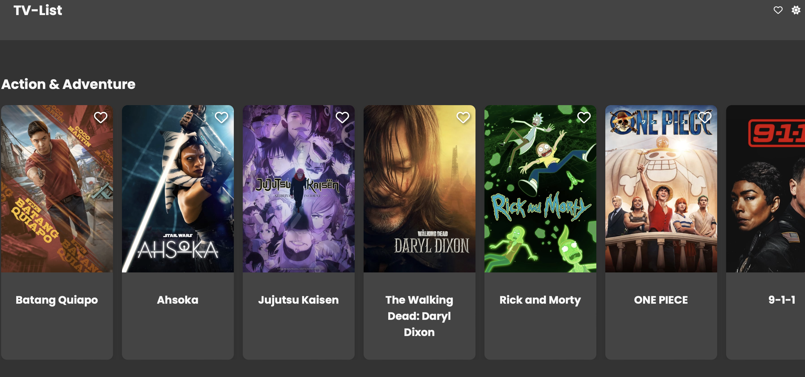

# TV-List

## Description

TV-List est une application web qui permet aux utilisateurs de parcourir une liste d'animes et de séries TV populaires. Grâce à cette application, les utilisateurs peuvent également marquer leurs animes et séries TV préférés en tant que favoris et les retrouver facilement sur une page dédiée.

## Fonctionnalités

- **Liste d'Animes**: Affiche une liste d'animes et séries TV populaires classés par catégorie.
- **Favoris**: Les utilisateurs peuvent ajouter ou retirer un anime ou une série TV de leurs favoris en cliquant sur une icône de cœur. Les favoris sont sauvegardés localement.
- **Thème Sombre**: Possibilité de passer en mode sombre pour une expérience utilisateur optimale lors de la navigation en soirée.

## Comment utiliser ?

1. Ouvrez `index.html` dans votre navigateur.
2. Parcourez la liste d'animes et séries TV.
3. Cliquez sur l'icône de cœur pour ajouter un anime ou une série TV à vos favoris.
4. Accédez à `favorite.html` pour voir votre liste de favoris. Vous pouvez également retirer des favoris de cette page.

## API

Cette application utilise l'API TMDB pour récupérer les données sur les animes et séries TV.

## Personnalisation

- Modifiez le fichier `styles.css` pour adapter le design à vos préférences ou à l'identité visuelle de votre marque.
- Si vous souhaitez ajouter des category, modifiez le script dans `main.js`.

## Contribution

Les contributions sont les bienvenues ! Veuillez créer une issue ou une pull request pour toute contribution ou suggestion.
